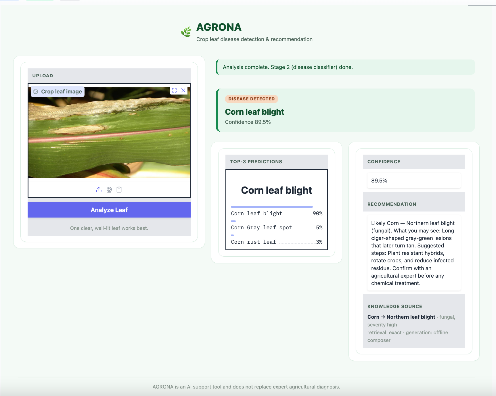

# AGRONA: Agro-Mind Crop Disease Image Classification

AGRONA is an AI-based computer vision system designed to support plant disease detection from leaf images. The system first validates whether the uploaded image is a plant leaf, then predicts the most likely disease class and provides a related recommendation through a lightweight knowledge-based recommendation layer.

The project focuses on improving reliability in real-world conditions, where plant images may include different lighting, backgrounds, angles, and camera quality.

---

## Project Overview

Manual crop disease inspection can be slow, expert-dependent, and difficult to scale. In addition, many AI models perform well on clean lab images but struggle with real-world field images because of the lab-to-field domain gap.

AGRONA addresses this problem using a two-stage pipeline:

1. **Leaf Gate Model**
   Checks whether the uploaded image is a valid plant leaf or a non-leaf image.

2. **Disease Classification Model**
   Predicts the most likely crop disease class from valid leaf images.

3. **Recommendation Layer**
   Retrieves disease-related guidance from a curated JSON knowledge base.

To improve reliability, low-confidence predictions are flagged for review instead of being presented as certain diagnoses.

---

## Demo Interface

The system is deployed using a Gradio interface, where users can upload a leaf image and receive:

* Leaf / not-leaf validation
* Disease prediction
* Confidence score
* Top predictions
* Disease-related recommendation



---

## System Architecture

AGRONA follows a two-stage computer vision pipeline:

1. The user uploads an image.
2. The image is preprocessed.
3. The leaf gate checks whether the image is a valid plant leaf.
4. If the image is not a leaf, the system rejects it.
5. If the image is valid, the disease classifier predicts the disease class.
6. The system returns the prediction, confidence score, and top predictions.
7. The recommendation layer retrieves related disease information.
8. The final output includes the prediction, confidence, and recommendation.


---

## Key Features

* Two-stage pipeline for safer prediction.
* Non-leaf image rejection.
* Disease classification from real-world plant images.
* Top prediction and confidence score display.
* Low-confidence handling for uncertain cases.
* Lightweight recommendation layer using a curated JSON knowledge base.
* Gradio-based user interface.

---

## Tech Stack

| Layer                | Technology                 |
| -------------------- | -------------------------- |
| Programming Language | Python                     |
| Deep Learning        | PyTorch, timm, torchvision |
| Data Processing      | pandas, NumPy              |
| Evaluation           | scikit-learn, Matplotlib   |
| Interface            | Gradio                     |
| Deployment           | Hugging Face Spaces        |
| Data Access          | Kaggle API, Git/GitHub     |
| Knowledge Base       | JSON                       |

---

## Project Structure

```text
AGRONA-Plant-Disease-Detection/
│
├── 01_data/
│   └── README.md
│
├── 02_notebooks/
│   └── AGRONA_Plant_Disease_Detection.ipynb
│
├── 03_src/
│   ├── app.py
│   └── rag.py
│
├── 04_models_artifacts/
│   ├── arch_benchmark.csv
│   ├── disease_classes.json
│   ├── gate_classes.json
│   ├── rag_kb.json
│   └── README.md
│
├── 05_assets/
│   ├── system_architecture.png
│   └── demo_screenshot.png
│
├── requirements.txt
├── .gitignore
└── README.md
```

---

## Data Sources

The project uses public research datasets:

1. **PlantVillage**
   Lab-controlled plant leaf disease images used during experimentation and domain-gap analysis.

2. **PlantDoc**
   Real-world field plant disease images used as the main dataset for training, validation, and testing.

3. **ImageNet-Mini**
   Generic non-plant images used to create negative examples for the leaf gate model.

The full datasets are not included in this repository due to size. Dataset links and preparation notes are documented in the `01_data/` folder.

---

## Data Processing

The data preparation process included:

* Train/validation split using stratification.
* Label remapping to fix class mismatch issues.
* Image resizing and normalization using ImageNet mean and standard deviation.
* Training-only data augmentation such as crop, flip, rotation, color jitter, and blur.
* Weighted sampling to reduce the effect of class imbalance.
* A balanced binary dataset for the leaf / not-leaf gate model.

---

## Model Architecture

AGRONA uses a two-stage computer vision architecture.

### Stage 1: Leaf Gate

A binary classifier that checks whether the uploaded image is a valid plant leaf.

Possible outputs:

* `leaf`
* `not_leaf`

### Stage 2: Disease Classifier

A multi-class image classification model that predicts the plant disease class from valid leaf images.

The team benchmarked four CNN-based architectures:

* ResNet18
* EfficientNet-B0
* MobileNetV2
* ConvNeXt-Tiny

---

## Benchmark Results

| Model           | Accuracy | Macro F1 | Top-3 Accuracy | Inference Time (ms) | Size (MB) | Notes                  |
| --------------- | -------: | -------: | -------------: | ------------------: | --------: | ---------------------- |
| ResNet18        |   0.5593 |   0.5180 |         0.8220 |                15.3 |      44.8 | Baseline               |
| EfficientNet-B0 |   0.6483 |   0.6323 |         0.8898 |                21.5 |      16.5 | Improved               |
| MobileNetV2     |   0.6356 |   0.6087 |         0.8983 |                17.4 |       9.3 | Lightweight            |
| ConvNeXt-Tiny   |   0.6992 |   0.6822 |         0.9280 |                44.1 |     111.4 | Strongest but heaviest |

ConvNeXt-Tiny achieved the best overall performance, while MobileNetV2 provided a lighter alternative with faster inference and smaller model size.

---

## Evaluation

The system was evaluated using the following metrics:

* Accuracy
* Macro F1-score
* Top-3 accuracy
* Inference time
* Model size
* Leaf / not-leaf rejection behavior
* Low-confidence handling

Predictions below the confidence threshold are flagged as needing review instead of being returned as reliable diagnoses.

---

## Experimental Finding

The team tested whether pretraining on lab-controlled PlantVillage images before training on real-world PlantDoc images would improve performance.

After benchmarking, direct training on field-style PlantDoc data achieved comparable or better results. Based on this finding, the final approach focused on the simpler and more efficient PlantDoc-based training pipeline.

---

## Limitations

* Real-world field accuracy is lower than lab-image accuracy due to lighting, background, angle, and camera quality variation.
* The test set is limited in size.
* Some classes have few samples, which affects per-class reliability.
* One mismatched class between train and test was excluded from the final evaluation.
* Low-confidence predictions still require expert review.
* The system is a decision-support tool and should not replace expert agricultural diagnosis.

---

## Future Work

Future improvements include:

* Expanding the dataset with more crops, diseases, and field conditions.
* Collecting more real-world plant images from different regions.
* Improving confidence calibration.
* Adding a FastAPI backend for integration with farm management platforms.
* Adding an expert feedback loop to improve future retraining.
* Deploying a lighter model for mobile or edge inference.

---

## How to Run

### 1. Clone the Repository

```bash
git clone https://github.com/your-username/AGRONA-Plant-Disease-Detection.git
cd AGRONA-Plant-Disease-Detection
```

### 2. Create a Virtual Environment

```bash
python -m venv .venv
```

For Windows:

```bash
.venv\Scripts\activate
```

For Mac / Linux:

```bash
source .venv/bin/activate
```

### 3. Install Requirements

```bash
pip install -r requirements.txt
```

### 4. Run the Gradio App

```bash
python 03_src/app.py
```

---

## Model Checkpoints

Large model checkpoint files are not included in this repository due to file size limitations.

Required checkpoint files:

```text
leaf_gate.pth
disease_convnext_tiny.pth
disease_efficientnet_b0.pth
disease_mobilenetv2_100.pth
disease_resnet18.pth
```

Place the checkpoint files inside:

```text
04_models_artifacts/
```

before running the application locally.

---

## Team

* Dana Al-Anizi
* Fatima Alhiri
* Lujain Abdullah
* Sama Alharbi

---

## References
Saudi Digital Academy and WeCloudData Academy
